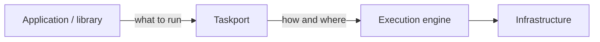
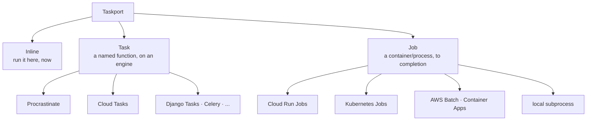
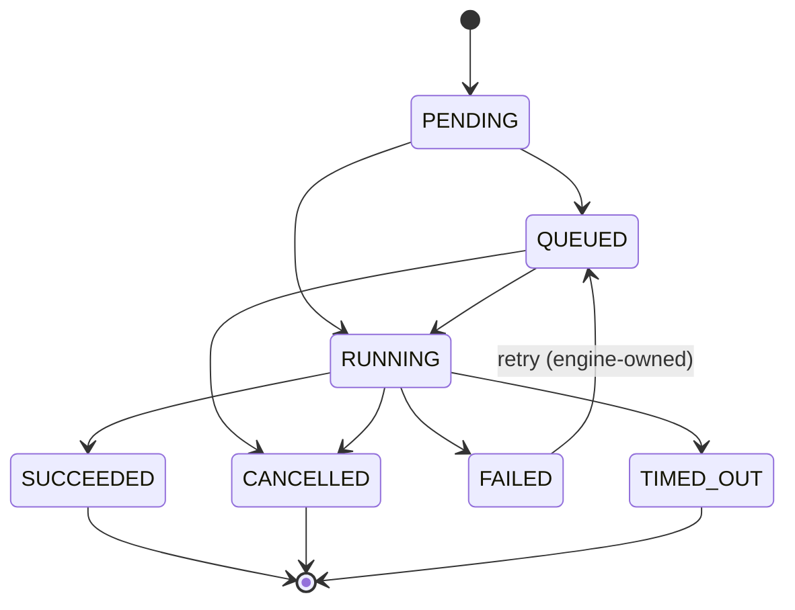
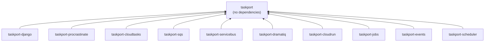

# Taskport

**Taskport is a portable execution layer for Python applications.**

It models units of work, chooses the right *kind* of execution, and routes them to
engines that already exist. It is not a task queue, not a worker system, not a
scheduler, and not a workflow engine. Its entire value is that your application
never has to name one.



## Sixty seconds in

```bash
pip install taskport
```

```python
from taskport import Taskport

runtime = Taskport.local()


def add(a: int, b: int) -> int:
    return a + b


execution = runtime.inline.submit(add, 20, 22)
assert execution.result().value == 42
```

No Django. No PostgreSQL. No Redis. No Procrastinate. No cloud account. No worker
process. `pip install taskport` installs **nothing but Taskport** — the
distribution declares zero dependencies, and [an architectural
test](packages/taskport/tests/test_architecture.py) fails the build if that ever
stops being true.

## What Taskport is

A thin, honest layer between "what should run" and "where it runs":

| Taskport does | Taskport delegates |
| --- | --- |
| model work as Inline, Task or Job | running workers |
| route work to a backend by queue/profile | queue storage and locking |
| declare what each backend can really do | job reservation and heartbeats |
| translate portable retry/timeout intent | scheduling and cron |
| give executions a portable identity and state machine | container orchestration |

## What Taskport is not

Explicitly, and permanently, out of scope: a task queue, a worker daemon, a
broker protocol, queue polling, distributed locks, a worker registry, a scheduler
daemon, a DAG engine, sagas, durable workflows, or human approvals. Procrastinate,
Celery, Cloud Tasks, Cloud Run, Kubernetes and Temporal already do those things
well. Taskport makes them interchangeable.

Every feature proposal gets asked one question: *does this belong to an execution
portability layer, or am I rebuilding something the engine already does?* If it is
the second, it gets delegated. See [ADR-0002](docs/adr/0002-not-a-task-queue.md).

## Three primitives

They are genuinely different, and Taskport refuses to collapse them.



| Primitive | Meaning | Runs in | Carries |
| --------- | ------- | ------- | ------- |
| **Inline** | run this right now | the calling process | a live callable, even a lambda |
| **Task** | do this operation later | a worker or a push endpoint | a name plus JSON arguments |
| **Job** | run this workload to completion | its own process or container | an image, argv, a resource envelope |

A Job is **not** "a Task that takes longer". It has its own image, its own CPU and
memory, its own lifecycle, and it returns an exit code rather than a Python value.
Collapsing the two would force every task engine to grow container semantics it
does not have. See [ADR-0003](docs/adr/0003-task-and-job.md).

```python
runtime.inline.submit(add, 20, 22)  # now, here
runtime.tasks.submit("myapp.tasks:send_email", 42)  # later, somewhere
runtime.jobs.submit("build-cog", image="gdal:latest")  # a container, to completion
```

## Routing: your code never names a provider

Application code says what *kind* of work this is. The deployment decides where
that runs.

```python
# myapp/services.py — this line never changes again
runtime.tasks.submit("myapp.tasks:extract_metadata", dataset_id, queue="metadata")
```

```python
# settings / config / env — this is what changes
{
    "backends": {
        "pg": {"factory": "procrastinate", "app": "myapp.tasks:app"},
        "push": {"factory": "cloudtasks", "project": "p", "location": "eu", "url": "..."},
        "heavy": {"factory": "cloudrun", "project": "p", "location": "eu"},
        "gpu": {"factory": "kubernetes", "namespace": "batch"},
    },
    "routes": [
        {"kind": "task", "queue": "metadata", "backend": "pg"},
        {"kind": "task", "queue": "email", "backend": "push"},
        {"kind": "job", "profile": "heavy", "backend": "heavy"},
        {"kind": "job", "profile": "gpu", "backend": "gpu"},
    ],
    "defaults": {"inline": "inline", "task": "pg", "job": "heavy"},
}
```

Rules are ordered and first-match-wins. When nothing matches and there is no
default, routing raises `RoutingError` naming every rule it tried — it never falls
back to "whatever is around".

## Capabilities: no backend pretends

Backends genuinely differ. Procrastinate can cancel a queued job; Cloud Tasks
cannot even report one's state. Cloud Run cannot allocate a GPU per execution;
AWS Batch can. Taskport refuses to paper over this.

```python
if Capability.CANCEL in handle.capabilities:
    handle.cancel()
```

An operation a backend does not advertise raises `UnsupportedCapability` — it is
never emulated, and never silently skipped.

```python
# Cloud Run cannot override GPU per execution, so this raises at submit time
# instead of quietly running your model on a CPU.
runtime.jobs.submit("train", resources=Resources(gpu=1), profile="cloudrun")
```

| | Procrastinate | Dramatiq | Cloud Tasks | SQS | Service Bus | Cloud Run | AWS Batch | Kubernetes |
| --- | :---: | :---: | :---: | :---: | :---: | :---: | :---: | :---: |
| `STATE` | yes | **no** | **no** | **no** | **no** | yes | yes | yes |
| `RESULT` | **no** | **no** | **no** | **no** | **no** | **no** | yes | **no** |
| `CANCEL` | yes | **no** | **no** | **no** | **no** | yes | yes | yes |
| `DELAY` | yes | yes | yes | ≤900s | unbounded | – | – | – |
| `PRIORITY` | yes | **no** | **no** | **no** | **no** | – | – | – |
| `DEDUPLICATION` | yes | **no** | yes | FIFO only | yes | – | – | – |
| `GPU` | – | – | – | – | – | **no** | yes | yes |

The blanks are the point, and they are
[asserted in tests](packages/taskport-jobs/tests/test_jobs.py), not just written
down. See [ADR-0005](docs/adr/0005-capability-model.md).

## Executions

Every backend, of every kind, reports in the same vocabulary.



`UNKNOWN` exists because some engines genuinely cannot report state. Adapters map
what the provider actually says; they never invent a transition it cannot observe.

```python
handle = runtime.tasks.submit("myapp.tasks:reindex", 42)

handle.id  # taskport's id, stable and short
handle.external_id  # the engine's id, for the provider's console
handle.status()  # re-read from the backend
handle.wait(30)  # block until terminal
handle.result()  # the outcome, or raise ExecutionError
handle.cancel()  # or raise UnsupportedCapability
```

## Async

Same vocabulary, one `await` apart:

```python
from taskport import AsyncTaskport

runtime = AsyncTaskport.local()

handle = await runtime.tasks.submit("myapp.tasks:send_email", 42)
execution = await handle.wait(30)
value = await handle.value()
```

`AsyncTaskport` wraps a sync runtime, so a process with async views and sync
management commands shares one set of backends and one connection pool:

```python
aio = AsyncTaskport(get_runtime())  # the project's existing runtime
```

The async path is real, not an `async def` painted over a blocking call — two
tests hold that honest by counting event-loop ticks during a slow job and by
requiring four 0.2s jobs to finish in ~0.2s. See
[docs/concurrency.md](docs/concurrency.md) and
[ADR-0015](docs/adr/0015-async-api.md).

## Guarantees, stated plainly

Taskport promises **at-least-once or at-most-once, depending on the backend**. It
never promises exactly-once, because no distributed system can honestly offer it.
`idempotency_key` is a tool for building idempotency where the backend supports
real deduplication — not a guarantee. See
[ADR-0010](docs/adr/0010-delivery-semantics.md).

Retries have exactly one owner, recorded on the policy, so five attempts never
become several hundred:

```python
RetryPolicy(max_attempts=5, backoff=Backoff.EXPONENTIAL, owner=RetryOwner.BACKEND)
```

**Taskport itself never retries.** It translates the intent into the engine's own
retry configuration and gets out of the way. See
[ADR-0011](docs/adr/0011-retry-ownership.md).

## The distributions

`pip install taskport` gives you the layer and the built-in local backends. Each
engine is a separate, optional distribution.

| Install | Provides | Needs |
| --- | --- | --- |
| `taskport` | runtime, router, sync + async API, local backends, CLI | nothing |
| `taskport-procrastinate` | Procrastinate task backend + worker dispatcher | PostgreSQL |
| `taskport-cloudtasks` | Cloud Tasks task backend + receiver | GCP |
| `taskport-sqs` | SQS task backend + Lambda/ECS consumers | AWS |
| `taskport-servicebus` | Azure Service Bus task backend + consumers | Azure |
| `taskport-dramatiq` | Dramatiq task backend + worker actor | Redis or RabbitMQ |
| `taskport-cloudrun` | Cloud Run Jobs backend | GCP |
| `taskport-jobs` | AWS Batch, Kubernetes, Azure Container Apps job backends | the matching SDK |
| `taskport-django` | `django.tasks` backend, settings, checks, `manage.py taskport` | Django |
| `taskport-events` | portable pub/sub fan-out | the matching SDK |
| `taskport-scheduler` | portable "when to fire" triggering | the matching SDK |



Adapters register themselves through the `taskport.backends` entry-point group, so
naming one in configuration is all it takes — Taskport never imports an adapter it
was not asked for. See [ADR-0013](docs/adr/0013-packaging-strategy.md).

## Django

Django is an **optional adapter**, in the direction Django expects. Application
code stays ordinary Django:

```python
# myapp/tasks.py — unchanged, forever
from django.tasks import task


@task
def resize_image(image_id: int) -> None: ...
```

```python
# settings.py — the only thing that changes engines
TASKS = {"default": {"BACKEND": "taskport_django.TaskportBackend"}}

TASKPORT = {
    "backends": {"pg": {"factory": "procrastinate", "app": "myapp.tasks:app"}},
    "defaults": {"task": "pg"},
}
```

`taskport-django` also gives you `submit_on_commit()` (so a worker never reaches a
row before it is committed), system checks that build every configured backend at
`manage.py check` time, and `manage.py taskport doctor`.

**`taskport` never imports Django.** The same configuration works in a FastAPI
service, a CLI, a notebook, or a library — none of which have to agree on a web
framework to agree on a queue.

## CLI

```bash
taskport backends            # what is configured, and where each route goes
taskport capabilities pg     # what one backend can actually do
taskport route --kind job --profile gpu
taskport submit-job build-cog --image gdal:latest -- python build.py
taskport status EXECUTION_ID --backend pg
taskport doctor              # is this deployment actually wired up?
```

`doctor` builds every configured backend, because "the adapter is installed" and
"the adapter works with these options" are different questions, and only the
second one matters at 3am.

## Extending Taskport

An adapter implements two methods, declares its capabilities, and passes the
contract suite the port ships:

```python
from taskport.contract import TaskBackendContract


class TestMyBackend(TaskBackendContract):
    def make_backend(self):
        return MyTaskBackend(client=FakeClient())

    def success_spec(self):
        return TaskSpec(task="tests.tasks:ok")
```

The suite is capability-driven: a backend that does not advertise `CANCEL` is
asserted to *reject* cancellation, not skipped.

## Documentation

- [Architecture](docs/architecture/refactor-2026.md) — the current design and how it got here
- [Async, threads and processes](docs/concurrency.md) — the concurrency model, precisely
- [Migration guide](docs/migration/0.1-to-0.2.md) — moving from 0.1
- [ADRs](docs/adr/) — every decision, with alternatives and consequences
- [Security](docs/security.md) — function resolution, allowlists, endpoint auth

## Development

```bash
uv sync --all-packages
uv run pytest
uv run ruff check .
uv run mypy packages/taskport/src packages/taskport-django/src
uv run python tooling/build_all.py
```

The core is testable with nothing installed:

```bash
uv run pytest packages/taskport     # no Django, no Procrastinate, no cloud SDK
```

## Status

Early but coherent. The vertical slice the design targets — inline, Procrastinate
tasks and Cloud Run jobs, all behind one API — is implemented and tested. The
public API listed in `taskport.__all__` is the surface intended to be stable from
here. See [the roadmap](docs/family/roadmap.md).

## License

Apache-2.0. See [LICENSE](LICENSE).
