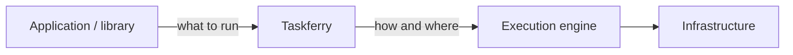

# ADR-0001: Taskferry is a portable execution layer

- Status: Accepted
- Date: 2026-07-26
- History: replaces the 0.1 "family of packages" framing (former ADR-0001)

## Context

Taskferry 0.1 described itself as a *family of portable execution primitives for
Python and Django*. In practice the framing had two defects.

The first was that "Task" — the primitive that matters most — existed only inside
Django. A task was a `django.tasks.base.Task`, and every task backend subclassed
`django.tasks.backends.base.BaseTaskBackend`. A CLI, a script, a notebook or a
library could not enqueue a task without installing and configuring Django. The
dependency direction was inverted for the central concept.

The second was that "family" implied four peer domains (Tasks, Jobs, Events,
Schedules) with no shared entry point. There was no `Runtime`, no `Router`, and no
portable `Execution`. Each domain invented its own status enum and its own handle
type. `import taskferry` gave you nothing, because `taskferry` was a PEP 420
namespace package that could not ship an `__init__.py`.

## Decision

Taskferry is a **portable execution layer**: one library that models units of work,
selects the appropriate execution kind, and routes them to existing engines
through adapters.

Concretely:

- `taskferry` becomes a regular package with a curated public API (`Taskferry`,
  `TaskSpec`, `JobSpec`, `Execution`, `ExecutionHandle`, `Router`, `Capability`).
- A single `Taskferry` runtime coordinates routing, backend construction,
  capability validation, handles and hooks.
- Tasks are modelled framework-agnostically as `TaskSpec`; Django becomes one
  adapter among several.
- Events and Schedules remain useful, separately-distributed concerns, but they
  are no longer framed as peers of the execution layer.

## Alternatives considered

**Keep the four-domain family and add a Task domain.** This would have fixed the
Django coupling without giving applications a single entry point, and callers
would still have selected backends by hand at every call site. The routing problem
— the actual source of provider coupling — would have remained unsolved.

**Make Taskferry a Django library and accept the coupling.** Simplest, and it
matches the original use case. Rejected because the primary consumer we are
designing toward is a framework-agnostic library, and because the interesting
deployments (Cloud Run jobs, CLI pipelines) have no web framework in the process
at all.

**Build one universal abstraction over "deferred work" covering tasks and jobs.**
Rejected for the reasons in [ADR-0003](0003-task-and-job.md).

## Consequences

- `from taskferry import Taskferry, TaskSpec, JobSpec` works, which was structurally
  impossible before.
- Any Python process can submit work; Django is optional in both directions.
- Backend selection moves from call sites into configuration, which is what makes
  changing engines a deployment decision rather than a refactor.
- `taskferry.core` remains a valid import path, now provided by `taskferry`.
- The 0.1 import paths for the domain packages break. See
  [the migration guide](../migration/0.1-to-0.2.md).
