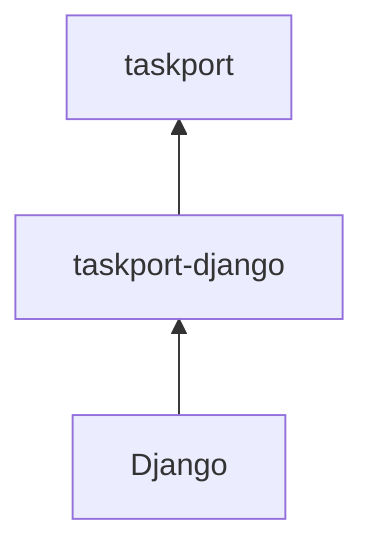

# ADR-0006: Frameworks are adapters, and they point inward

- Status: Accepted
- Date: 2026-07-26

## Context

Taskport's original home was a Django project, and 0.1 reflected that: the task
backends *were* Django Tasks backends. Any other framework, or none, was a
second-class citizen that could not use the most important primitive at all.

## Decision

`taskport` never imports a web framework. Framework integration lives in adapter
distributions that depend on Taskport, never the reverse.

`taskport-django` supplies:

- `TaskportBackend`, a real `django.tasks` backend that translates to `TaskSpec`;
- `config_from_settings()`, the only place in the project that reads
  `django.conf.settings`;
- `submit_on_commit()`, built on `transaction.on_commit`;
- system checks and `manage.py taskport`.

Taskport does **not** add a parallel task API for Django. Django 6 already has
one; competing with it would give applications two ways to do the same thing.

### The dispatcher

`@task` replaces a function with a `django.tasks.base.Task` object, which is not
callable. Rather than teach `taskport` what a Django Task is, `taskport-django`
routes every task through one entry point (`taskport_django.execute:run_task`)
that knows how to run one. The Django task path travels as data.

This mirrors what `taskport-procrastinate` does, has the useful side effect that a
worker's import allowlist needs exactly one module, and keeps Django's own
`Task.call()` semantics intact.

## Alternatives considered

**Let `taskport` special-case Django Task objects when resolving a function.** One
`isinstance` check, and the layer would import Django. Rejected outright: this is
the coupling the whole redesign exists to remove.

**Ship a `@taskport.task` decorator for Django users.** Rejected — a second task
API in a framework that has one is a migration burden with no benefit.

**Have `taskport` read a config file itself, so Django needs no adapter.** Then
Taskport owns a file format and a discovery order, and Django users configure
their app in two places. Rejected in favour of
[ADR-0007](0007-configuration.md).

## Consequences

- `pytest packages/taskport` passes in an environment with no Django installed,
  and CI runs exactly that as a separate job.
- The same `TASKPORT` dict can be lifted verbatim into a FastAPI service or a CLI.
- FastAPI, Flask and Starlette need no adapter at all: they call the runtime
  directly, and `taskport-cloudtasks`'s receiver takes bytes rather than a
  framework request object.
- `spec.task` is the same string for every Django task, so `spec.name` and a
  `django_task` label carry the real identity. A documented trade-off.
