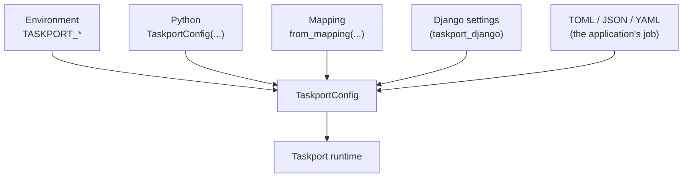

# ADR-0007: Typed configuration, many sources, one model

- Status: Accepted
- Date: 2026-07-26
- History: absorbs former ADR-0006 (configuration flows in, not out)

## Context

Taskport needs to know which backends exist, how to build them, and where work
routes. That information comes from different places in different deployments:
Django settings, environment variables, a TOML file, or plain Python in a test.

Two failure modes to avoid: a library that reaches into `os.environ` from deep
inside an adapter (untestable, invisible), and a library that couples its
configuration model to one framework's settings object.

## Decision

`TaskportConfig` is the internal model: a frozen, validated dataclass. Everything
else is a *loader* that produces one.

Rules:

- **The core never reads `django.conf.settings`**, and an architectural test
  enforces it. `taskport_django.config_from_settings()` is the only reader.
- Environment variables are an important source — they are how a Twelve-Factor
  deployment configures anything — but never the internal model. Structure travels
  as JSON in `TASKPORT_BACKENDS` / `TASKPORT_ROUTES` so nested provider options
  survive intact.
- Validation happens **at construction**: a route naming an undefined backend
  raises immediately, rather than the first time that queue is used in production.
- Every component is injectable: `Taskport(backends=..., router=..., hooks=...)`.
  There are no global singletons, which is what makes tests cheap.
- Backends are built **lazily** on first use. Configuring a Cloud Run backend
  costs a web process nothing, and importing the Google SDK never happens in a
  process that only enqueues tasks.

## Alternatives considered

**Make environment variables the model, with everything else converting into
them.** Would force nested provider options through string flattening
(`TASKPORT_BACKENDS_PG_OPTIONS_APP`), which is unreadable and lossy. Rejected.

**Own a config file format (`taskport.toml`) with discovery rules.** Adds a file
format, a search path and a precedence order to a library that has none of those
problems today. Applications already know how to read their own config; they can
hand us a dict. Rejected.

**A module-level global runtime configured once at import.** Convenient, and it
makes tests order-dependent and parallel test runs unreliable. Rejected;
`taskport_django` keeps a *process-wide* runtime because connection pools should
not be per-request, but it is explicitly resettable.

## Consequences

- Configuration is inspectable (`runtime.describe()`, `taskport backends`) without
  building anything, so a broken adapter can still be diagnosed.
- A misconfiguration surfaces at startup or at `manage.py check`, not at 3am.
- Applications choosing YAML or TOML write four lines of loader. That is the right
  amount of code for something this project should not own.
