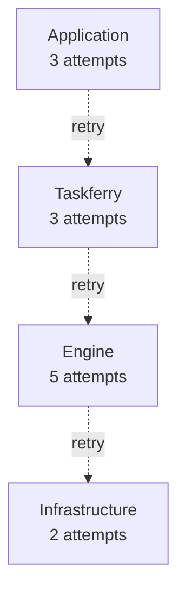

# ADR-0011: Exactly one layer retries, and it is written down

- Status: Accepted
- Date: 2026-07-26

## Context

Retries compose multiplicatively, which is almost never what anyone intends.

Three attempts at each of four layers is ninety attempts, and the failure mode is
a retry storm against a service that was already struggling. Every layer's
configuration looks reasonable in isolation.

In 0.1, `JobSpec.max_retries` was an untyped int forwarded to whichever provider
happened to read it, with no statement anywhere about who acts on it.

## Decision

**Taskferry itself never retries.** A `RetryPolicy` is a portable *declaration of
intent* that a backend translates into its engine's native retry configuration.

`RetryOwner` records who will actually act on it:

| Owner | Meaning | Effect |
| --- | --- | --- |
| `BACKEND` (default) | the engine retries natively | the policy is translated and Taskferry stays out of the way |
| `APPLICATION` | the caller retries | the engine is configured for a single attempt, so the two do not multiply |
| `NONE` | nobody retries | a failure is final |

`RetryPolicy.engine_attempts` encodes that arithmetic in one place, and it is what
every adapter passes to its engine.

The in-process backends (inline, thread, process) are a consistent special case:
there, Taskferry *is* the engine, so `BACKEND` means they retry themselves. The
Procrastinate adapter is the interesting one — its dispatcher raises
Procrastinate's own retry signal, so the job is genuinely re-queued by
Procrastinate with the requested delay rather than a worker slot being held while
something sleeps.

## Alternatives considered

**Taskferry performs retries uniformly across all backends.** Consistent, and
wrong: retrying a remote task means holding the submitting process open, which is
impossible for a fire-and-forget push queue and pointless for a Cloud Run job.
Rejected.

**No retry model at all; use `backend_options` per engine.** Honest but not
portable — moving a queue would silently drop its retry configuration. Rejected.

**Infer the owner from whether the backend advertises `RETRY`.** Convenient, but
it makes the answer implicit, and the whole problem is that nobody knows who is
retrying. Rejected in favour of writing it on the policy.

## Consequences

- `RetryPolicy(max_attempts=5)` means five attempts total, at exactly one layer.
- A spec with a backend-owned retry requires `Capability.RETRY`, so an engine that
  cannot retry rejects it instead of dropping it.
- `retry_on` / `no_retry_on` are advisory: engines that cannot filter by exception
  type do not advertise the ability, and the contract suite asserts they say so.
- Applications that retry themselves must set `owner=APPLICATION`, or they get the
  multiplication this ADR exists to prevent.
