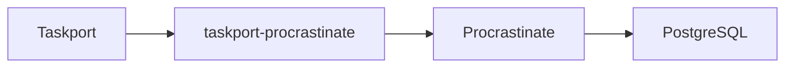

# ADR-0012: Taskport does not implement a task queue

- Status: Accepted
- Date: 2026-07-26

## Context

A portability layer that sits in front of queues is under constant pressure to
become one. Each step is individually reasonable: a small in-memory queue for
tests, then persistence so it survives a restart, then a worker so something
drains it, then reservation so two workers do not collide, then heartbeats so a
dead worker's jobs are recovered. Eighteen months later the "thin layer" is a
worse Celery that nobody chose.

The 0.1 roadmap already contained several of these steps.

## Decision

Taskport will **never** implement, inside any of its distributions:

- a PostgreSQL or Redis queue
- a worker daemon or worker pool manager
- task reservation, leases or visibility timeouts
- worker heartbeats or a worker registry
- distributed locks
- a broker protocol
- queue polling
- a scheduler daemon
- a DAG engine, sagas, durable workflows, or human approvals

Every one of these belongs to an execution engine. Taskport delegates.

Taskport does not know how Procrastinate uses PostgreSQL, and must not learn.

The rule applied to every proposal: *does this belong to an execution portability
layer, or am I rebuilding something the engine already does?*

### The one deliberate exception, and its limits

`taskport` ships in-process backends: inline, a thread pool, a process pool and a
subprocess runner. They exist so the library is usable with zero infrastructure —
in a test, a notebook, a CLI — and so every port has a reference implementation to
test adapters against.

They are **not** queues, and their docstrings, their capability sets and this ADR
all say so. They are not durable, not visible across processes, and they lose
pending work on restart. `taskport-django`'s system checks warn when one is routed
to in a `DEBUG = False` deployment.

## Alternatives considered

**Ship a "good enough" durable local queue (SQLite-backed).** Tempting: it would
make the zero-dependency story stronger for small deployments. Rejected because
"good enough" is exactly how this ends — the first user with two web workers needs
reservation, and the slope from there is short and well-documented in the history
of other projects.

**Ship nothing local at all; require an adapter always.** Rejected because it
would make Taskport unusable in a test suite, a notebook or a CLI without standing
up PostgreSQL, and would remove the reference implementations the contract suites
are validated against.

## Consequences

- Taskport stays small, which is the only way it stays honest.
- Users must choose an engine for production. Taskport makes that choice cheap and
  reversible; it does not make it for them.
- An architectural test greps the core for the vocabulary of engine features
  (`worker_heartbeat`, `advisory_lock`, `queue_poll`, `reserve_job`, ...) and
  fails the build if any appears.
