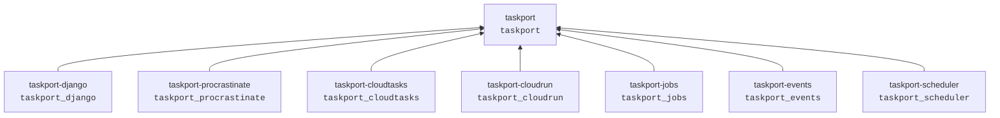

# ADR-0013: One distribution per top-level module

- Status: Accepted
- Date: 2026-07-26
- History: replaces the 0.1 PEP 420 namespace-package approach (former ADR-0003)

## Context

0.1 used a PEP 420 namespace package: five distributions all contributing to
`taskport.*` (`taskport.core`, `taskport.jobs`, `taskport.django`, ...). It gave a
tidy import surface.

It also made `from taskport import Taskport` **structurally impossible**. A PEP 420
namespace package cannot contain an `__init__.py`, so no distribution could ship
the public API. And editable installs of namespace-sharing distributions break in
ways that are tedious to diagnose and depend on installer version.

## Decision

Every distribution owns its own top-level module.

- `taskport-core` is absorbed into `taskport`. `taskport.core` remains a valid
  import path, now provided by the `taskport` distribution.
- `taskport` declares **zero dependencies**, asserted by a test that reads the
  metadata as well as the source.
- Provider SDKs live in extras (`taskport-jobs[aws]`), never in required
  dependencies, so installing an adapter never forces an SDK you do not use.
- Adapters advertise their backends through the `taskport.backends` entry-point
  group, so configuration can name one without anything importing it eagerly.

## Alternatives considered

**Keep the namespace package and accept `taskport.api` as the public surface.**
Preserves the tidy imports at the cost of an awkward extra module and the editable
install fragility. The brief explicitly requires `from taskport import Taskport`.
Rejected.

**One distribution with every adapter behind extras.** Simplest to release, and it
means `pip install taskport` has to at least *know about* every provider, the
release cadence is shared, and a bug in the Azure adapter blocks a core release.
Rejected — independent versioning is the point.

**A single `taskport` distribution plus one `taskport-adapters` bundle.** Halfway
between the two, with the disadvantages of both. Rejected.

## Consequences

- `pip install taskport` installs nothing else. This is the headline property, and
  it is tested three ways: source scan, runtime `sys.modules` check, and metadata.
- Import paths from 0.1 break: `taskport.jobs` → `taskport_jobs`,
  `taskport.django` → `taskport_django`. See
  [the migration guide](../migration/0.1-to-0.2.md).
- `taskport_*` is slightly less elegant than `taskport.*`. Accepted: a public API
  that exists beats a namespace that reads nicely.
- Each package remains independently buildable and extractable to its own
  repository, which [ADR-0014](0014-monorepo-to-multirepo.md) still describes.
