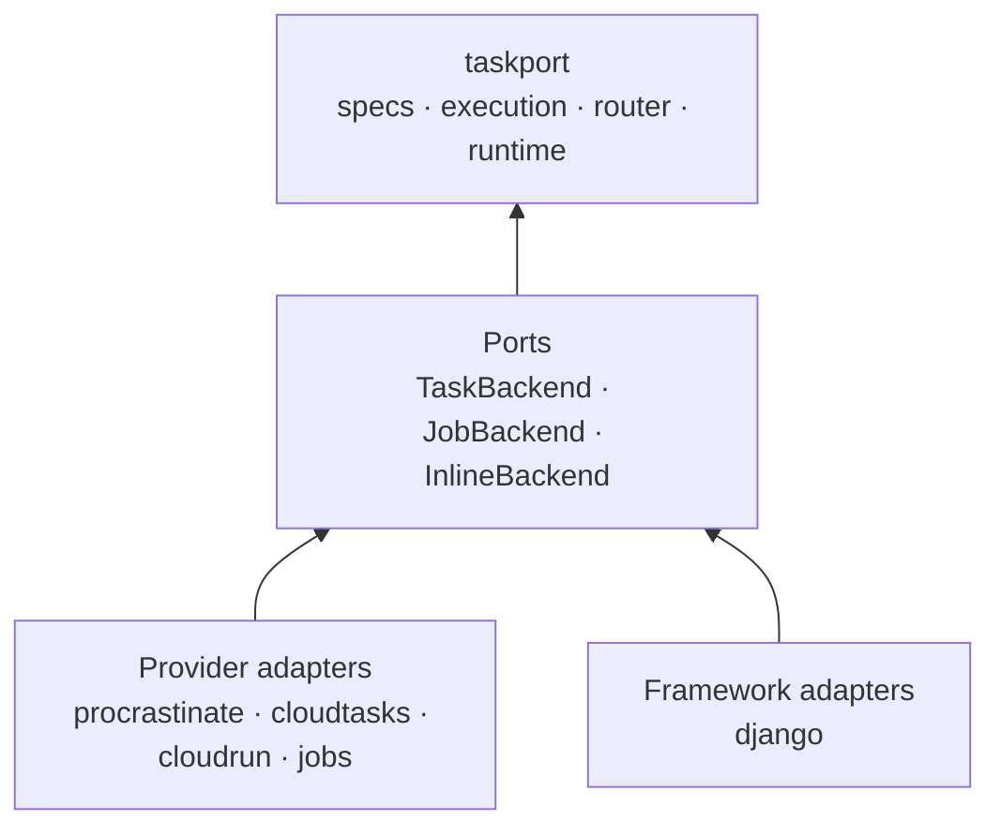
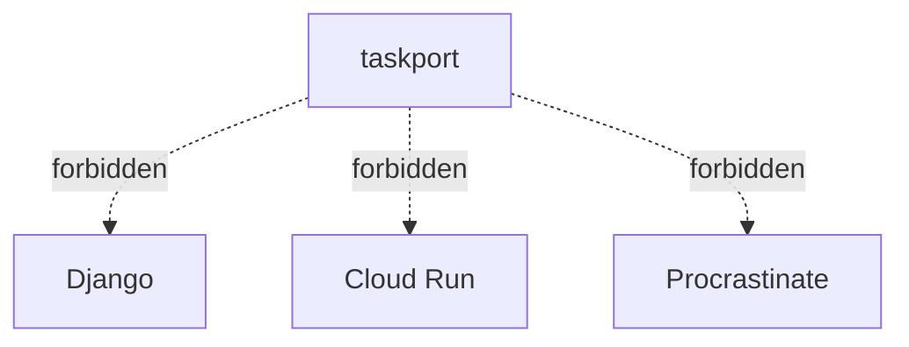
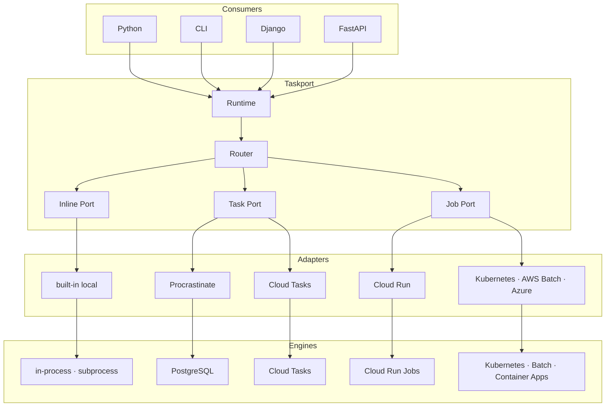

# Architecture overview

> The detailed treatment — including what the 0.1 architecture got wrong and how
> the migration was carried out — is in
> [the 2026 refactor document](refactor-2026.md). This page is the summary.

Taskport is a portable execution layer. Applications depend on small, stable
contracts; adapters implement those contracts on real engines. Dependencies always
point **inward**.

Never the reverse:

## The full picture

## The guarantees, and how they are enforced

| Guarantee | Enforced by |
| --- | --- |
| `taskport` imports no framework or provider SDK | AST scan of every source file |
| nothing heavy lands in `sys.modules` | subprocess import probe |
| `pip install taskport` installs nothing else | metadata check + a CI job in a bare venv |
| adapters do not depend on each other | AST scan across distributions |
| no adapter contributes to the `taskport` package | layout check |
| the core does not grow engine features | vocabulary scan |

All six live in
[`packages/taskport/tests/test_architecture.py`](https://github.com/taskport/taskport/blob/main/packages/taskport/tests/test_architecture.py)
and run on every commit.

## Import weight

Provider SDKs are imported **lazily**, inside the method that needs a client, and
adapters are discovered through entry points rather than imported eagerly. A web
process that only enqueues tasks never imports the Google SDK, even with
`taskport-cloudrun` installed.
