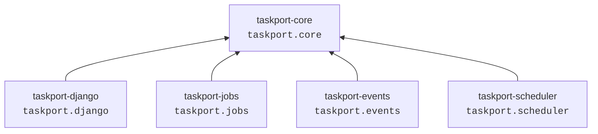
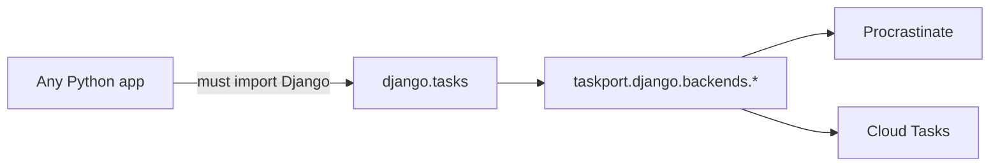
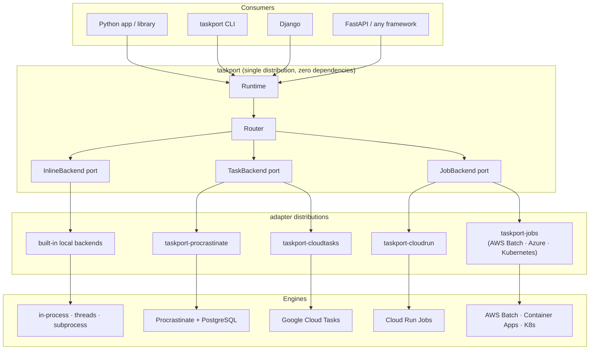
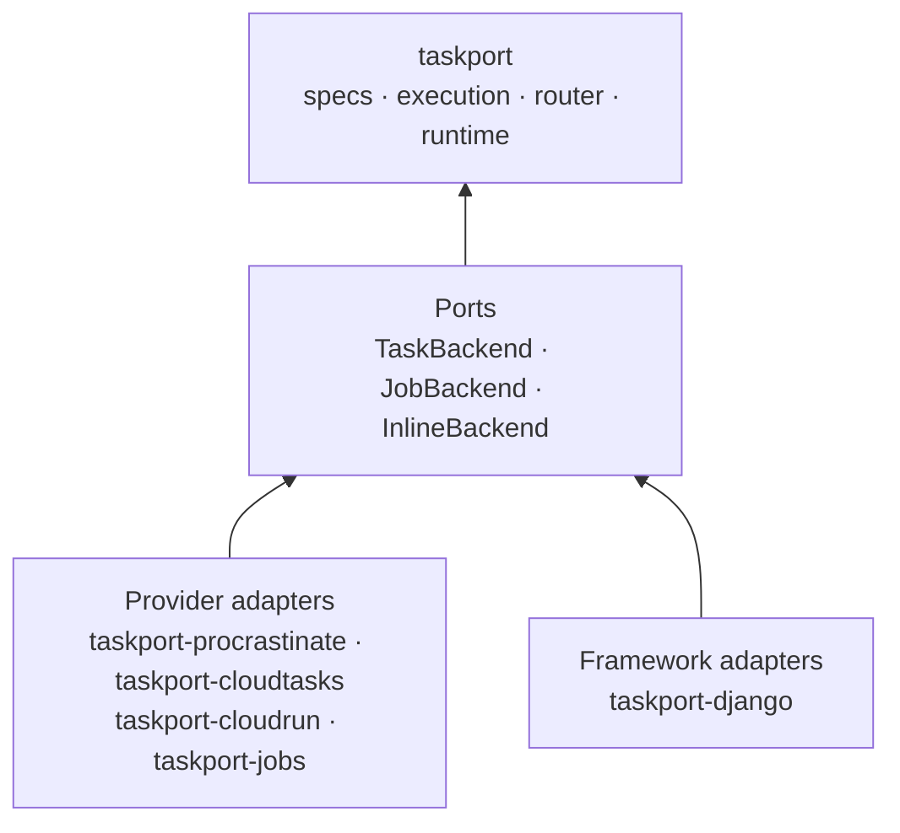
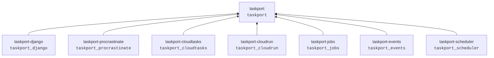
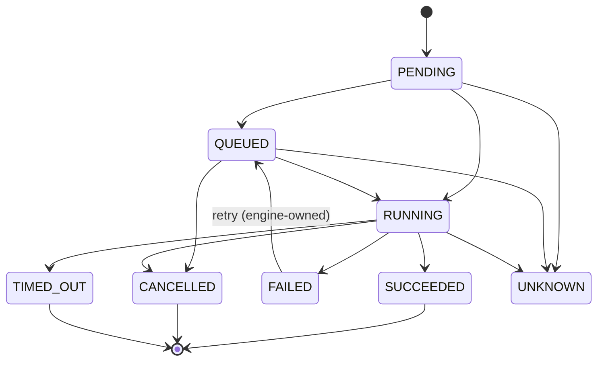
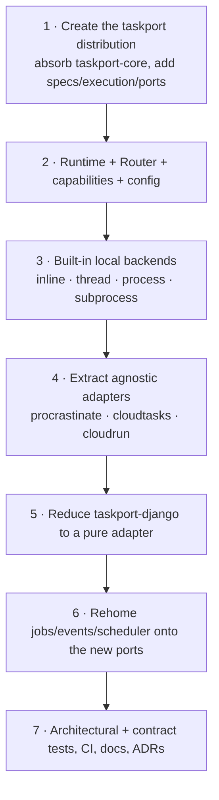

# Taskport refactor — from "family of primitives" to portable execution layer

Status: **accepted and implemented** (0.2.0)
Date: 2026-07-26
Supersedes the architecture described in [overview.md](overview.md) (0.1.x).

This document records both the design and the execution. Section 1 describes the
0.1 architecture — deliberately, in the past tense — and sections 2 and 3 the
problems it had and what replaced them. Section 4 records how the migration was
carried out and what it cost.

---

## 1. Architecture before the refactor

Taskport 0.1 was a *family* of five independently published distributions sharing
one PEP 420 namespace package, `taskport`.



`taskport-core` held the transversal substrate: ids, correlation, capabilities,
provider metadata, config helpers, JSON serialization, observability hooks, a
lazy registry and the root error hierarchy. It imported nothing but the standard
library — that part was already correct and is preserved.

Each domain package owned a port, a template base class applying cross-cutting
rules, a capability enum, a registry and provider adapters that imported their
SDK lazily:

| Package              | Port             | Adapters                                        |
| -------------------- | ---------------- | ----------------------------------------------- |
| `taskport-jobs`      | `JobRunner`      | local, Cloud Run, AWS Batch, Azure, Kubernetes  |
| `taskport-events`    | `EventPublisher` | in-memory, Pub/Sub, SNS/EventBridge, Event Grid, Kafka |
| `taskport-scheduler` | `Scheduler`      | local, Cloud Scheduler, EventBridge, CronJob    |
| `taskport-django`    | *(none)*         | Django Tasks backends: local, Cloud Tasks, SQS, Procrastinate, Dramatiq, Service Bus |

## 2. Problems found

### P1 — Tasks existed only inside Django (blocking)

The single most important execution primitive had **no framework-agnostic
model**. `TaskSpec` did not exist. A "task" was `django.tasks.base.Task`, and
every task adapter subclassed `django.tasks.backends.base.BaseTaskBackend`:



A CLI, a script, a notebook or a library such as DRATL could not enqueue a task
without installing and configuring Django. The dependency direction was inverted
for the primitive that matters most.

### P2 — No Runtime, no Router, no Execution

There was no single entry point, no routing layer and no portable execution
identity. Each domain exposed a global registry (`runners`, `publishers`,
`schedulers`) and callers indexed it by alias by hand:

```python
runners["default"].run(spec)  # caller picks the backend
```

Backend selection was therefore an application concern, hard-coded at every call
site. There was no `Execution`, no `ExecutionState`, no `ExecutionHandle`; each
domain invented its own status enum (`JobStatus`, `ScheduleStatus`) and its own
handle (`JobHandle`, `ScheduleHandle`) with no shared vocabulary and no
documented state machine.

### P3 — No Inline primitive

Nothing modelled "run this right now, in this process". `LocalBackend` was a
Django `ImmediateBackend` subclass; `LocalJobRunner` spawned a subprocess. The
zero-infrastructure path from the brief —

```python
runtime = Taskport.local()
execution = runtime.inline.submit(add, 20, 22)
```

— was not expressible.

### P4 — `import taskport` gave you nothing

`taskport` was an implicit namespace package. There was no public API surface;
callers imported from `taskport.core`, `taskport.jobs`, `taskport.django.backends.cloud_tasks`
— deep internals, all of them.

### P5 — Retry, timeout and idempotency were not modelled

`JobSpec.max_retries` was an untyped int forwarded to whichever provider
happened to read it. There was no `RetryPolicy`, no backoff vocabulary, no
statement of *which layer owns the retry*, and no idempotency-key API — despite
ADR-0008 correctly refusing to promise exactly-once.

### P6 — No function-reference model

`taskport.django.message.resolve_task` imported an arbitrary dotted path from an
untrusted message and called `getattr`. Workable for Django tasks; unsuitable as
the general mechanism, with no registry, no allowlist and no portable
`package.module:function` contract.

### P7 — Capability enums were per-domain and non-comparable

`JobCapability.CANCEL`, `TaskCapability.CANCELLATION` and
`ScheduleCapability.PAUSE` were unrelated types. A router or a CLI could not ask
"does this backend support cancel?" across kinds.

### P8 — Namespace package blocked a real public API

Because `taskport` was PEP 420, no distribution could ship `taskport/__init__.py`.
The requirement `from taskport import Taskport, TaskSpec, JobSpec` was structurally
impossible under the old layout.

### P9 — Roadmap contained execution-engine work

`docs/family/roadmap.md` listed items that belong to the engines Taskport is
supposed to delegate to, not to a portability layer.

### Non-problems (deliberately preserved)

* `taskport-core` imported no framework and no provider SDK. **Correct.**
* Every adapter imported its SDK lazily, inside a method. **Correct.**
* Capabilities were advertised honestly and unsupported operations raised rather
  than being simulated. **Correct.**
* Contract test suites existed per port. **Correct — generalised, not replaced.**
* No exactly-once promise anywhere. **Correct.**

## 3. Target architecture

Taskport is a **portable execution layer**: it models units of work, selects the
appropriate execution kind and routes them to existing engines through adapters.
It does not implement queues, workers, brokers, schedulers or workflow engines.



### Three execution primitives

| Primitive  | Meaning                                    | Where it runs                  |
| ---------- | ------------------------------------------ | ------------------------------ |
| **Inline** | run now, in this process                   | the calling process            |
| **Task**   | logical unit of work for a task engine     | a worker or a push endpoint    |
| **Job**    | isolated, heavy or long-running workload   | its own process or container   |

A Job is not "a Task that takes longer". They are separate primitives with
separate specs, separate ports and separate capability profiles.

### Dependency direction



`taskport` depends on nothing but the standard library. An architectural test
enforces that it never imports `django`, `procrastinate`, `celery`, `redis`,
`psycopg`, `sqlalchemy`, `google.cloud`, `kubernetes`, `boto3`, `azure`,
`fastapi` or `flask`, at import time or anywhere in its source.

### Package layout

Because a distribution cannot ship `taskport/__init__.py` while other
distributions contribute `taskport.*` subpackages (PEP 420 forbids it, and
editable installs break outright), every adapter distribution now owns its **own
top-level module**:



`taskport-core` is absorbed into `taskport`; `taskport.core` remains a valid
import path, now provided by the `taskport` distribution.

### Execution state machine



`UNKNOWN` exists because some engines cannot report state for an arbitrary
execution id. Adapters map provider states onto this model; they never invent a
transition the provider cannot observe.

## 4. Migration strategy

The refactor was executed in seven stages, each leaving the test suite green.



### What was preserved

Everything that was already correct was moved, not rewritten: the whole
`taskport.core` substrate, the local subprocess runner, the Cloud Run status
mapping, the Cloud Tasks enqueue logic, the Procrastinate defer logic, every
cloud job runner, the events and scheduler packages, and the contract-test idea.

### What broke

`taskport.jobs`, `taskport.events`, `taskport.scheduler` and `taskport.django`
moved to `taskport_jobs`, `taskport_events`, `taskport_scheduler` and
`taskport_django`. `JobRunner` became `JobBackend`; `JobStatus` became
`ExecutionState`. The Django-coupled provider backends were replaced by
framework-agnostic adapters plus a single Django bridge backend.

See [the migration guide](../migration/0.1-to-0.2.md) for the mechanical steps, and
[ADR-0011](../adr/0011-portable-execution-layer.md) through
[ADR-0020](../adr/0020-packaging-strategy.md) for each decision in full.

### What was removed from the roadmap

Anything that belongs to an execution engine rather than to a portability layer:
a PostgreSQL or Redis queue, worker daemons, task reservation, heartbeats, worker
registries, distributed locks, broker protocols, queue polling, an own scheduler
daemon, and any DAG/saga/durable-workflow runtime.
