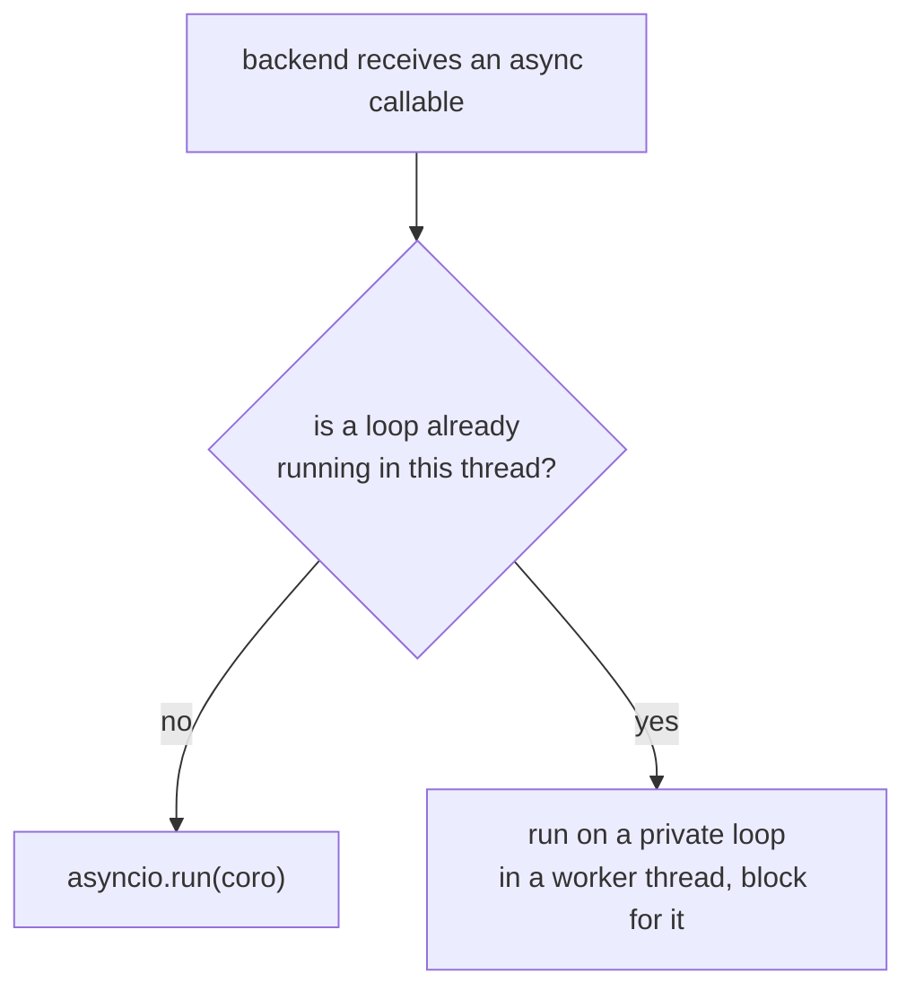

# Async, threads and processes

Two questions this page answers precisely, because getting either wrong produces
bugs that only appear under load:

1. **What happens to an `async def` function?**
2. **Which Taskport objects can be shared, and across what?**

## The async model

Taskport's public API is **synchronous**. `submit()` returns an
`ExecutionHandle`; `wait()` and `result()` block.

That is a deliberate choice, not an oversight. Taskport's job is to hand work to
an engine, which is a fast, local, usually-blocking operation — a `defer()` into
PostgreSQL, a `create_task` HTTP call, a `Popen`. Making the whole surface async
would force every caller into an event loop to gain nothing, and would make the
library unusable from a management command or a `__main__` script.

### `async def` task functions are fully supported

The *work* being async is a completely separate question from the *API* being
async, and async work is supported everywhere:

```python
async def fetch_and_store(url: str) -> int:
    async with httpx.AsyncClient() as client:
        response = await client.get(url)
    return len(response.content)


runtime.inline.submit(fetch_and_store, "https://example.com")  # awaited
runtime.tasks.submit(fetch_and_store, "https://example.com")  # awaited on the worker
```

Backends that can run them advertise
:attr:`~taskport.Capability.ASYNC_CALLABLE`. Detection unwraps
`functools.partial` and looks through `__call__`, so async callable *objects* work
too, not just plain `async def`.

### How the await happens



The second branch matters. Calling `asyncio.run()` inside a running loop raises
`RuntimeError`, so a naive implementation would explode the first time someone
called `runtime.inline.submit(some_async_fn)` from inside an async web handler.
Taskport instead runs the coroutine on its own loop in a worker thread and blocks
for the result — which is the honest behaviour, because `submit()` is synchronous
by contract.

**Blocking a running event loop is bad.** Taskport does it because the alternative
is raising, and it is documented here rather than hidden. Inside async code:

- for **inline** work, just `await` the coroutine yourself — you do not need
  Taskport to run something in the process you are already in;
- for **tasks and jobs**, `submit()` is a short local operation. If it is on a hot
  path, wrap it: `await asyncio.to_thread(runtime.tasks.submit, fn, arg)`.

### What does not exist yet

There is no `await runtime.tasks.submit(...)`. Adding one needs a decision about
whether every adapter implements both surfaces or one is derived from the other,
and doing that by accident would leave half the adapters with a fake async path
that blocks. It is on [the roadmap](family/roadmap.md) as a deliberate design
task.

### Django

`django.tasks` exposes `aenqueue()`, which Django implements over `enqueue()` with
`sync_to_async(thread_sensitive=True)`. `TaskportBackend` inherits that, so
`await my_task.aenqueue(42)` works and does the right thing.

## Thread and process safety

### The summary table

| Object | Mutable state | Share across threads | Cross a process boundary |
| --- | --- | --- | --- |
| `TaskSpec` · `JobSpec` · `InlineSpec` | none — frozen, mappings proxied | yes | yes, by value |
| `Execution` · `ExecutionResult` | none — frozen snapshot | yes | yes, by value |
| `RetryPolicy` · `TimeoutPolicy` · `Resources` | none — frozen | yes | yes, by value |
| `Route` · `Router` | none — immutable | yes | yes, by value |
| `TaskportConfig` · `BackendConfig` | none — frozen | yes | yes, by value |
| `Capability` · `CapabilitySet` | none — frozen, hashable | yes | yes, by value |
| `HookChain` | none — immutable tuple | yes | no (hooks are live objects) |
| `Correlation` | none — frozen | yes | yes, via `to_headers()` |
| `Taskport` runtime | backend cache, execution index | **yes** — lock-guarded | no |
| `ExecutionHandle` | cached snapshot | **yes** — lock-guarded | no — carry `handle.id` |
| `ExternalIdIndex` | the id map | **yes** — lock-guarded | no |
| `FunctionRegistry` | the name map | reads yes, **registration no** | no |
| built-in backends | pools, records | **yes** — lock-guarded | no |

### Immutability is the default

Every model type is a frozen dataclass, and every mapping field is wrapped in a
`MappingProxyType` at construction — so a caller who mutates the dict they passed
in does not silently change a spec that has already been submitted:

```python
payload = {"key": "value"}
spec = TaskSpec(task="pkg.mod:fn", kwargs=payload)
payload["key"] = "changed"
assert spec.kwargs["key"] == "value"  # unaffected
```

To change a spec, `evolve()` returns a copy. There is no in-place setter anywhere
in the public API.

### The runtime is safe to share

A single `Taskport` is meant to be held for the life of the process and used from
every thread — which is exactly what a web server does. Specifically:

- **backend construction** is guarded by an `RLock`, so a backend is built
  **exactly once** even when sixteen threads request it simultaneously (asserted
  in `test_a_backend_is_built_exactly_once_under_contention`);
- **the execution index** is lock-guarded and bounded;
- **the router, config and serializer** are immutable, so reads need no lock.

Sharing one runtime is not just permitted, it is the point: backends hold
connection pools, and building a runtime per request would open a pool per
request.

### Handles are process-local

An `ExecutionHandle` holds a reference to a live backend object, so it cannot be
pickled or sent anywhere. Carry the **id** instead:

```python
handle = runtime.tasks.submit("myapp.tasks:reindex", 42)
store_somewhere(str(handle.id))  # a plain string

# elsewhere, in another process
runtime.get(execution_id, backend="pg")  # rebuild a handle
```

Note the `backend=` argument. The runtime's `id → backend` index is in-memory and
per-process, so another process has to be told which engine owns the execution.
`get()` says so in its error message rather than broadcasting a lookup to every
configured engine — polling a cloud API for an id it has never seen is slow,
costly and misleading.

Adapters also accept the **engine's own id** (`"4711"` for Procrastinate, a
`projects/.../executions/...` path for Cloud Run), so an operator holding an id
from a provider console can always look it up from anywhere.

### Register functions at import time

`FunctionRegistry` is safe for concurrent **resolution** and not for concurrent
**registration**. Register at import time — which is the normal pattern anyway,
and what `runtime.tasks.submit(some_callable)` does on your behalf — and the read
path is then safe to share freely.

### What crosses a process boundary

Only a function **name** and **JSON arguments**. Never a callable, never a live
object, never a pickle. That is what makes a payload readable in `psql`, safe to
unpickle-never, and survivable across a Python upgrade — see
[ADR-0017](adr/0017-serialization.md).

`ProcessTaskBackend` exists largely to make you feel this constraint during
development rather than in production: it dispatches to a real second interpreter,
so code relying on a closure or a module-level global mutated at import time fails
locally, where it is cheap.

### Cancellation, honestly

Python cannot safely interrupt a thread mid-call, and Taskport does not pretend
otherwise:

- **`ThreadTaskBackend` / `ProcessTaskBackend`** cancel only work that has not
  started. The returned `Execution` says which happened — a task already running
  comes back still `RUNNING`, not falsely `CANCELLED`.
- **`SubprocessJobBackend`** really does stop the work: `terminate()`, then
  `kill()` after a grace period.
- **`InlineExecutionBackend`** does not advertise `CANCEL` at all, because by the
  time `submit()` returns the work is over.

Same reasoning for timeouts: inline does not advertise `TIMEOUT`, because nothing
can preempt a synchronous call in the calling thread. A spec asking for one is
rejected rather than accepted and ignored.
