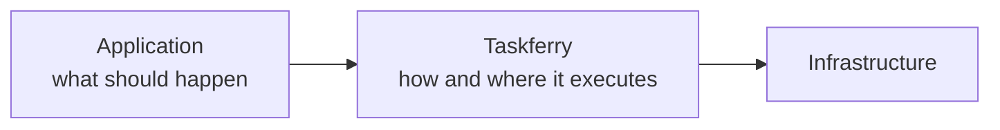
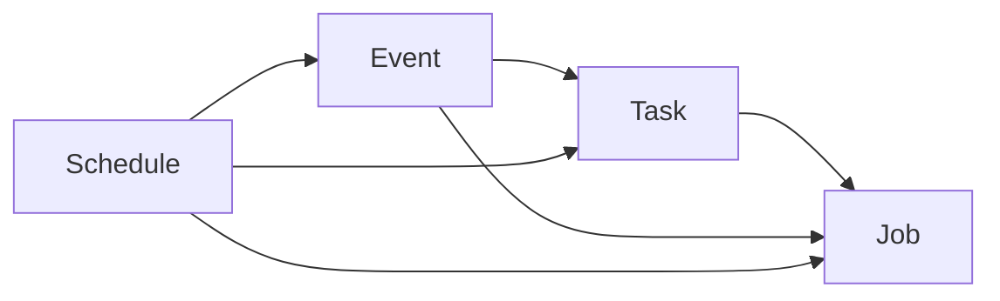

# Composition patterns

Execution kinds compose. Composition is done in **application code**, by
capability — Taskferry never merges the abstractions and never auto-wires them.
Taskferry is not, and will not become, a workflow or DAG engine.

The frontier is the whole design:



Your application knows that a COG build follows metadata extraction. Taskferry
knows that one runs on a worker and the other in a container.

## Supported compositions



| Composition | Meaning |
| --- | --- |
| Task → Job | a short task decides heavy work is needed and submits it |
| Event → Task | an event consumer enqueues follow-up work |
| Event → Job | an event consumer submits a workload |
| Schedule → Task / Job / Event | a schedule fires the next step when due |

## Task → Job

The task decides *what* should happen next; the job port decides *where* it runs.

```python
from taskferry import Taskferry

runtime: Taskferry = ...  # your application's runtime


def extract_metadata(dataset_id: int) -> dict:
    metadata = read_metadata(dataset_id)

    if metadata["needs_cog"]:
        # Heavy work does not belong on a task worker: it needs its own image,
        # its own memory and its own lifecycle. Routing decides whether "heavy"
        # means a local subprocess or Cloud Run.
        runtime.jobs.submit(
            f"build-cog-{dataset_id}",
            image="gdal:latest",
            args=["--dataset", str(dataset_id)],
            profile="heavy",
        )

    return metadata
```

Runnable version:
[`examples/composed-flow`](https://github.com/taskferry/taskferry/tree/main/examples/composed-flow).

## Event → Task and Event → Job

```python
from taskferry import Taskferry
from taskferry_events import Event

runtime: Taskferry = ...


def on_user_registered(event: Event) -> None:
    runtime.tasks.submit("myapp.tasks:send_welcome", event.data["user_id"], queue="email")


def on_dataset_updated(event: Event) -> None:
    runtime.jobs.submit("reindex", image="indexer:latest", profile="heavy")
```

## Schedule → anything

```python
from taskferry import Taskferry
from taskferry_scheduler import CronTrigger, Schedule, schedulers

runtime: Taskferry = ...


def nightly_reindex() -> None:
    runtime.jobs.submit("nightly-reindex", image="indexer:latest", profile="heavy")


schedulers["default"].create(
    Schedule(name="nightly", trigger=CronTrigger(expression="0 3 * * *"), target=...)
)
```

Scheduling stays separate from execution: a scheduler decides *when*, and then
submits through the runtime like any other caller.

## Correlation ties it together

Every step propagates a `Correlation` — same `correlation_id`, advancing
`causation_id` — so an HTTP request → Task → Event → Job chain is observable as
one logical flow, with no orchestration engine involved.

```python
from taskferry import Correlation, use_correlation

with use_correlation(Correlation.start()):
    runtime.tasks.submit("myapp.tasks:extract_metadata", 42)
```

Adapters copy the correlation into engine metadata — Cloud Tasks HTTP headers, a
Procrastinate message field — so it survives the hop.

## Explicitly out of scope

DAG workflows, state machines, sagas, durable execution and replacements for
Temporal, Airflow, Step Functions or Cloud Workflows are **not** part of Taskferry.
It may integrate with them; it will not reinvent them. See
[ADR-0002](../adr/0002-not-a-task-queue.md).
