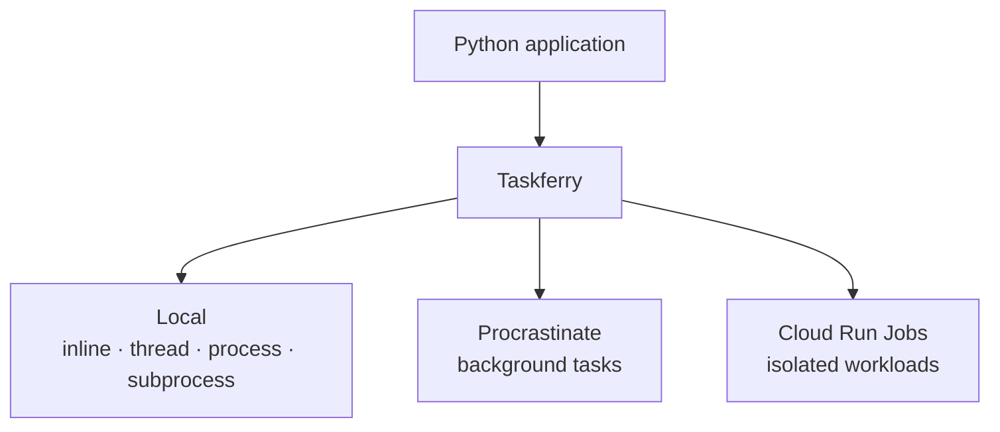

# Roadmap & status

Versioning is per-distribution SemVer with **no lockstep**. Every distribution is
independently buildable and releasable.

## What is done

The vertical slice the design targets is implemented and tested:

That covers immediate execution, background task execution and external heavy job
execution behind one API — which was the condition for calling the layer usable.

### `taskferry` — 0.2.0

Runtime, router, capabilities, executions and handles, specs, retry and timeout
policies, function registry, the portable wire envelope, hooks, plugin discovery,
configuration, CLI, reusable contract suites, four built-in local backends, and
the async surface (`AsyncTaskferry`). Zero dependencies, enforced three ways.

### Adapters — 0.2.0

| Distribution | Status |
| --- | --- |
| `taskferry-procrastinate` | ✅ task backend + worker dispatcher, contract-tested |
| `taskferry-cloudtasks` | ✅ task backend + framework-agnostic receiver |
| `taskferry-sqs` | ✅ task backend + Lambda/ECS consumers, per-queue capabilities |
| `taskferry-servicebus` | ✅ task backend + consumers, unbounded scheduling |
| `taskferry-dramatiq` | ✅ task backend + worker actor |
| `taskferry-celery` | ✅ task backend + worker dispatcher, engine-owned retries |
| `taskferry-cloudrun` | ✅ job backend, contract-tested |
| `taskferry-jobs` | ✅ AWS Batch, Kubernetes, Azure Container Apps job backends |
| `taskferry-django` | ✅ `django.tasks` backend, settings, on-commit, checks, CLI |
| `taskferry-events` | ✅ in-memory, Pub/Sub, SNS/EventBridge, Event Grid, Kafka |
| `taskferry-scheduler` | ✅ local, Cloud Scheduler, EventBridge, CronJob |

## What is next

Ordered by how much each would teach us about whether the abstraction holds.

1. **Natively async adapters.** Every backend has a working async path derived
   with `asyncio.to_thread`. An adapter built on `aiobotocore` or an async
   Procrastinate connector could skip the thread entirely — a performance
   refinement, not a correctness one.
2. **Streaming logs for the *cloud* job backends.** The local subprocess backend
   now streams (`stream_logs`); Cloud Run, AWS Batch and Kubernetes still expose
   only a log *location*, and wiring each provider's own log stream behind the
   same method is the remaining gap.

Recently shipped from this list:

- **`taskferry-celery`** — a Celery task backend. `TaskSpec` reached Celery
  unchanged, so the task port held.
- **`taskferry-otel`** — the OpenTelemetry bridge as its own distribution,
  removing the last optional dependency from the core.
- **Local job log streaming** — `SubprocessJobBackend.stream_logs` follows a
  running job's output line by line, like `tail -f`.

## What will never be built

Anything belonging to an execution engine rather than to a portability layer: a
PostgreSQL or Redis queue, worker daemons, task reservation, heartbeats, worker
registries, distributed locks, broker protocols, queue polling, a scheduler
daemon, or a DAG/saga/durable-workflow runtime.

This is not a "not yet" list. See [ADR-0002](../adr/0002-not-a-task-queue.md).
