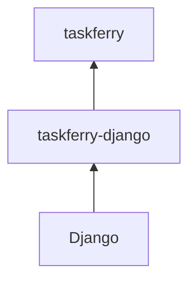

# taskferry-django

Django integration for [Taskferry](https://github.com/xiidigital/taskferry).



Taskferry does **not** invent a parallel task API — Django 6 already has one. This
package supplies a backend for the standard `TASKS` setting, so your `@task` code
never changes while the engine behind it becomes a configuration choice.

```bash
pip install taskferry-django taskferry-procrastinate
```

## Your code never changes

```python
# myapp/tasks.py
from django.tasks import task


@task
def resize_image(image_id: int) -> None: ...
```

```python
# anywhere
resize_image.enqueue(42)
```

## Settings

```python
TASKS = {"default": {"BACKEND": "taskferry_django.TaskferryBackend"}}

TASKFERRY = {
    "backends": {
        "pg": {"factory": "procrastinate", "app": "myapp.tasks:app"},
        "heavy": {"factory": "cloudrun", "project": "p", "location": "europe-west1"},
    },
    "routes": [
        {"kind": "task", "queue": "metadata", "backend": "pg"},
        {"kind": "job", "profile": "heavy", "backend": "heavy"},
    ],
    "defaults": {"task": "pg", "job": "heavy"},
}
```

With no `TASKFERRY` setting at all, everything runs locally — a fresh project works
immediately and is obviously not production.

## What else you get

**Enqueue after commit.** The classic race — a worker reaching a row before the
transaction that created it commits — with the classic fix:

```python
from django.db import transaction
from taskferry_django import task_on_commit


def create_order(request):
    with transaction.atomic():
        order = Order.objects.create(...)
        task_on_commit("myapp.tasks:process_order", order.id)
```

**System checks.** `manage.py check` builds every configured backend, because
"the adapter is installed" and "the adapter works with these options" are
different questions:

```text
taskferry.E002  the Taskferry backend 'heavy' cannot be built: CloudRunJobBackend
               needs both 'project' and 'location'
taskferry.W003  DEBUG is False but these Taskferry backends run in this process and
               lose pending work on restart: fast
```

**The CLI, with settings loaded.**

```bash
python manage.py taskferry doctor
python manage.py taskferry capabilities pg
```

**Jobs and inline execution**, through the same runtime:

```python
from taskferry_django import get_runtime

get_runtime().jobs.submit("build-cog", image="gdal:latest", profile="heavy")
```

## The dependency direction

`taskferry` never imports Django. The test suite for the core runs — and CI runs
it — in an environment where Django is not installed. The same `TASKFERRY` dict
works verbatim in a FastAPI service, a CLI or a library.

## License

Apache-2.0.
