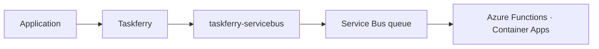

# taskferry-servicebus

Run [Taskferry](https://github.com/xiidigital/taskferry) tasks on **Azure Service
Bus** — pull-based delivery with unrestricted scheduling.



```bash
pip install 'taskferry-servicebus[azure]'
```

## Why it is a separate package from SQS

Both are pull-based queues, and they differ where it counts:
`scheduled_enqueue_time_utc` accepts **any** future time, so a task deferred by a
week is a first-class operation here and impossible on SQS, which caps at 900
seconds.

One "queue adapter with a flag" would have to pick a lowest common denominator.
Two adapters with two honest capability sets do not. See
[ADR-0005](https://github.com/xiidigital/taskferry/blob/main/docs/adr/0005-capability-model.md).

## Sending

```python
runtime = Taskferry.from_mapping(
    {
        "backends": {
            "sb": {
                "factory": "servicebus",
                "connection_string": "Endpoint=sb://...",
                "queue_name": "tasks",
            }
        },
        "defaults": {"task": "sb"},
    }
)

runtime.tasks.submit("myapp.tasks:reindex", 42, delay=timedelta(days=7))
```

Managed Identity instead of a connection string:

```python
{
    "factory": "servicebus",
    "namespace": "myns.servicebus.windows.net",
    "credential": DefaultAzureCredential(),
    "queue_name": "tasks",
}
```

## Consuming

**Azure Functions:**

```python
from taskferry import FunctionRegistry
from taskferry_servicebus import process_message

REGISTRY = FunctionRegistry(allowed_modules=["myapp"])


def main(msg: func.ServiceBusMessage) -> None:
    process_message(msg.get_body(), registry=REGISTRY)
```

**Container Apps / a plain process:**

```python
from taskferry_servicebus import receive_forever

receive_forever(client, "tasks", registry=REGISTRY)
```

Completes on success, abandons on failure so Service Bus redelivers and
eventually dead-letters per the queue's `MaxDeliveryCount`.

## Capabilities

| Capability | Supported | How |
| --- | :---: | --- |
| `SUBMIT` | yes | `send_messages` |
| `DELAY` | yes | `scheduled_enqueue_time_utc`, **unbounded** |
| `RETRY` | yes | the queue's delivery count and dead-letter policy |
| `DEDUPLICATION` | yes | `message_id`, when the queue has duplicate detection on |
| `STATE` · `RESULT` · `CANCEL` | **no** | no lookup of one message after enqueue |

`DEDUPLICATION` is real but bounded by the queue's duplicate-detection window —
a tool for idempotency, never an exactly-once promise. See
[ADR-0010](https://github.com/xiidigital/taskferry/blob/main/docs/adr/0010-delivery-semantics.md).

## License

Apache-2.0.
