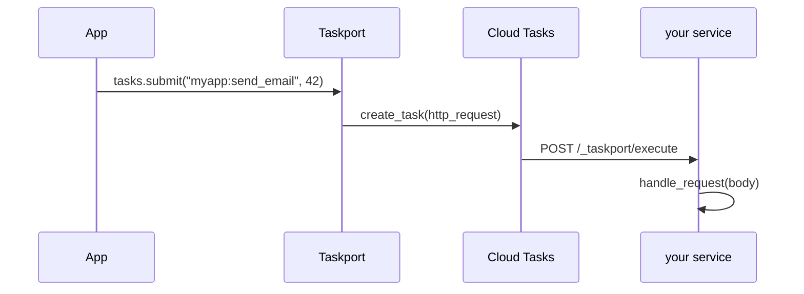

# taskport-cloudtasks

Run [Taskport](https://github.com/taskport/taskport) tasks on **Google Cloud
Tasks** — push-based, serverless, no worker process.



Cloud Tasks is architecturally the opposite of Procrastinate — nothing polls, no
worker exists, Google pushes an HTTP request at your service. The application
code does not change:

```python
runtime.tasks.submit("myapp.tasks:send_email", 42, queue="email")
```

## Install

```bash
pip install 'taskport-cloudtasks[gcp]'
```

## Configure

```python
runtime = Taskport.from_mapping(
    {
        "backends": {
            "push": {
                "factory": "cloudtasks",
                "project": "my-project",
                "location": "europe-west1",
                "url": "https://my-service.run.app/_taskport/execute",
                "service_account_email": "runner@my-project.iam.gserviceaccount.com",
            }
        },
        "defaults": {"task": "push"},
    }
)
```

## Receive

`handle_request` takes bytes, so it works with any framework:

```python
# Django
from taskport import FunctionRegistry
from taskport_cloudtasks import handle_request

REGISTRY = FunctionRegistry(allowed_modules=["myapp"])


def taskport_execute(request):
    handle_request(request.body, dict(request.headers), registry=REGISTRY)
    return HttpResponse(status=204)
```

```python
# FastAPI
@app.post("/_taskport/execute")
async def execute(request: Request):
    handle_request(await request.body(), dict(request.headers), registry=REGISTRY)
    return Response(status_code=204)
```

**Authenticate the endpoint.** Verify the OIDC token Cloud Tasks sends, or put
the service behind IAM. Taskport never sees your framework's request object —
that is what makes it portable, and it is why this part is yours.

**Be idempotent.** Cloud Tasks delivery is at-least-once.

## Capabilities

| Capability | Supported | Why |
| ---------- | :-------: | --- |
| `SUBMIT` · `DELAY` · `RETRY` | yes | `create_task`, `schedule_time`, queue retry config |
| `DEDUPLICATION` | yes | task names are unique per queue for a bounded window |
| `STATE` · `RESULT` | **no** | Cloud Tasks reports nothing per task after creation |

A handle refuses `status()` here instead of returning a plausible `UNKNOWN`
forever. Record what you need in your own database, where it is actually true.

## License

Apache-2.0.
