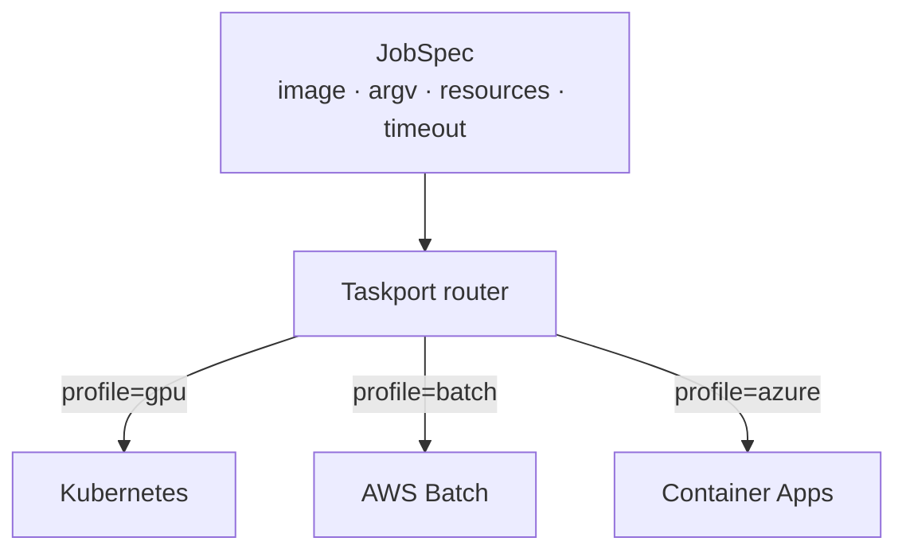

# taskport-jobs

Batch job backends for [Taskport](https://github.com/taskport/taskport): **AWS
Batch**, **Kubernetes** and **Azure Container Apps Jobs**.



```bash
pip install 'taskport-jobs[aws]'
pip install 'taskport-jobs[kubernetes]'
pip install 'taskport-jobs[azure]'
```

Every SDK is imported lazily inside the backend that needs it, so
`import taskport_jobs` pulls in none of them.

## Use

```python
from taskport import Resources, Taskport

runtime = Taskport.from_mapping(
    {
        "backends": {
            "gpu": {"factory": "kubernetes", "namespace": "batch"},
            "batch": {"factory": "aws-batch", "job_queue": "q", "job_definition": "d"},
        },
        "routes": [
            {"kind": "job", "profile": "gpu", "backend": "gpu"},
            {"kind": "job", "profile": "batch", "backend": "batch"},
        ],
    }
)

handle = runtime.jobs.submit(
    "train-model",
    image="pytorch:2.4-cuda",
    profile="gpu",
    resources=Resources(cpu="8", memory="32Gi", gpu=2),
    timeout=7200,
)
```

## Capabilities

| | AWS Batch | Kubernetes | Container Apps | (Cloud Run) | (subprocess) |
| --- | :---: | :---: | :---: | :---: | :---: |
| `CPU` / `MEMORY` | yes | yes | yes | no | no |
| `GPU` | yes | yes | **no** | **no** | **no** |
| `PARALLELISM` | yes | yes | yes | yes | **no** |
| `TIMEOUT` | yes | yes | yes | yes | yes |
| `RESULT` | yes | **no** | **no** | **no** | yes |

The "no"s are the point, and they are asserted in the test suite rather than only
documented. A spec asking for a GPU on Container Apps raises
`UnsupportedCapability` at submit time instead of running on a CPU and returning
results nobody can explain three days later.

## Resource translation

`Resources` uses Kubernetes quantity syntax (`"1000m"`, `"512Mi"`) because it is
unambiguous about units and every runtime can convert *from* it:

| `Resources` | Kubernetes | AWS Batch | Container Apps |
| --- | --- | --- | --- |
| `cpu="2000m"` | `2000m` | `VCPU: 2` | `cpu: 2.0` |
| `memory="16Gi"` | `16Gi` | `MEMORY: 16384` | `memory: 16Gi` |
| `gpu=2` | `nvidia.com/gpu: 2` | `GPU: 2` | rejected |

## Testing

Every client is injectable, so the whole suite runs with no cloud account and no
cluster:

```python
KubernetesJobBackend(api=FakeBatchV1Api())
BatchJobBackend(client=FakeBatchClient(), job_queue="q", job_definition="d")
```

## License

Apache-2.0.
