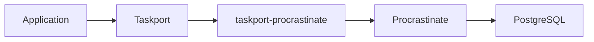

# taskport-procrastinate

Run [Taskport](https://github.com/taskport/taskport) tasks on
[Procrastinate](https://procrastinate.readthedocs.io) — a durable, PostgreSQL-backed
task engine.



Taskport does not implement a queue, a worker, job reservation or retries.
Procrastinate already does all of that, correctly, on PostgreSQL. This package is
the translation layer between the two — and nothing else.

## Install

```bash
pip install 'taskport-procrastinate[procrastinate]'
```

PostgreSQL becomes a dependency of your deployment only once you select this
backend. `taskport` itself has no dependencies at all.

## Submitting

```python
from taskport import Taskport

runtime = Taskport.from_mapping(
    {
        "backends": {"pg": {"factory": "procrastinate", "app": "myapp.tasks:app"}},
        "defaults": {"task": "pg"},
    }
)

runtime.tasks.submit("myapp.tasks:refresh_metadata", 42, queue="metadata")
```

## Executing

Register the dispatcher once, then run Procrastinate's own worker:

```python
# myapp/tasks.py
from procrastinate import App, PsycopgConnector
from taskport import FunctionRegistry
from taskport_procrastinate import register_dispatcher

app = App(connector=PsycopgConnector(conninfo="postgresql://..."))

# An allowlist matters: task names arrive from the queue.
register_dispatcher(app, registry=FunctionRegistry(allowed_modules=["myapp"]))
```

```bash
procrastinate --app=myapp.tasks.app worker
```

## Capabilities

| Capability | Supported | How |
| ---------- | :-------: | --- |
| `SUBMIT` | yes | `defer()` |
| `STATE` | yes | job manager |
| `CANCEL` | yes | `cancel_job_by_id` |
| `DELAY` | yes | `schedule_at` |
| `PRIORITY` | yes | native job priority |
| `RETRY` | yes | engine-owned, via the retry signal |
| `DEDUPLICATION` | yes | `queueing_lock` |
| `RESULT` | **no** | Procrastinate stores no return values |

`RESULT` is absent because Procrastinate genuinely does not keep results.
Taskport raises `UnsupportedCapability` rather than inventing a results table —
building queue features is precisely what this project exists not to do.

## Backend options

```python
TaskSpec(
    task="myapp.tasks:reindex",
    backend_options=BackendOptions(
        {
            "procrastinate": {
                "lock": "reindex-42",  # serialise jobs against a key
                "queueing_lock": "reindex",  # refuse a duplicate while one is pending
            }
        }
    ),
)
```

## License

Apache-2.0.
