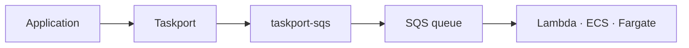

# taskport-sqs

Run [Taskport](https://github.com/taskport/taskport) tasks on **AWS SQS** —
pull-based delivery, consumed by a Lambda, an ECS service, or your own loop.



```bash
pip install 'taskport-sqs[aws]'
```

## Sending

```python
runtime = Taskport.from_mapping(
    {
        "backends": {
            "sqs": {
                "factory": "sqs",
                "queue_url": "https://sqs.eu-west-1.amazonaws.com/123456789/tasks",
            }
        },
        "defaults": {"task": "sqs"},
    }
)

runtime.tasks.submit("myapp.tasks:send_email", 42, queue="email")
```

## Consuming

**AWS Lambda**, with partial batch responses enabled:

```python
from taskport import FunctionRegistry
from taskport_sqs import process_event

REGISTRY = FunctionRegistry(allowed_modules=["myapp"])


def handler(event, context):
    return process_event(event, registry=REGISTRY)
```

**ECS / Fargate / a plain process:**

```python
import boto3
from taskport_sqs import poll_forever

poll_forever(boto3.client("sqs"), QUEUE_URL, registry=REGISTRY)
```

`poll_forever` long-polls, deletes on success, leaves failures for SQS's own
redrive policy, and stops cleanly on SIGTERM. It is forty lines and deliberately
not a worker framework — SQS already solves visibility timeouts and dead-lettering.

## Capabilities

| Capability | Standard queue | FIFO queue | Why |
| --- | :---: | :---: | --- |
| `SUBMIT` | yes | yes | `send_message` |
| `DELAY` | yes | **no** | FIFO delay is queue-level, not per message |
| `DEDUPLICATION` | **no** | yes | `MessageDeduplicationId` |
| `RETRY` | yes | yes | the queue's redrive policy |
| `STATE` · `RESULT` · `CANCEL` | **no** | **no** | SQS cannot look up or revoke one message |

The capability set is computed **per queue**, because a `.fifo` queue genuinely
differs from a standard one and one class serving both must say which it is.

Two limits are enforced rather than clamped:

- **900 seconds of delay, maximum.** A longer delay raises with the limit named,
  instead of arriving 15 minutes from now when you asked for tomorrow.
- **FIFO queues refuse per-message delay** rather than dropping it silently.

## Testing

The client is injectable, so the suite runs with no AWS account:

```python
SQSTaskBackend(queue_url="https://sqs.eu-west-1.amazonaws.com/1/q", client=FakeSQS())
```

## License

Apache-2.0.
